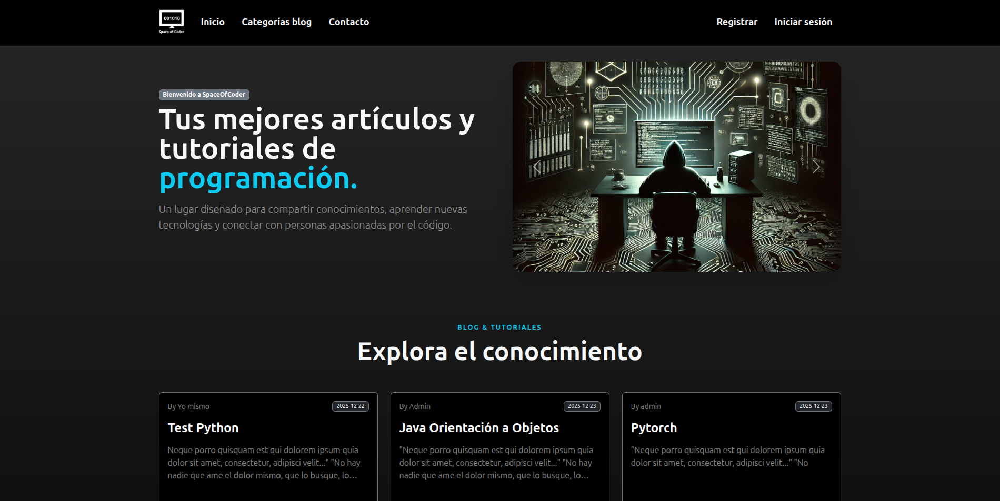
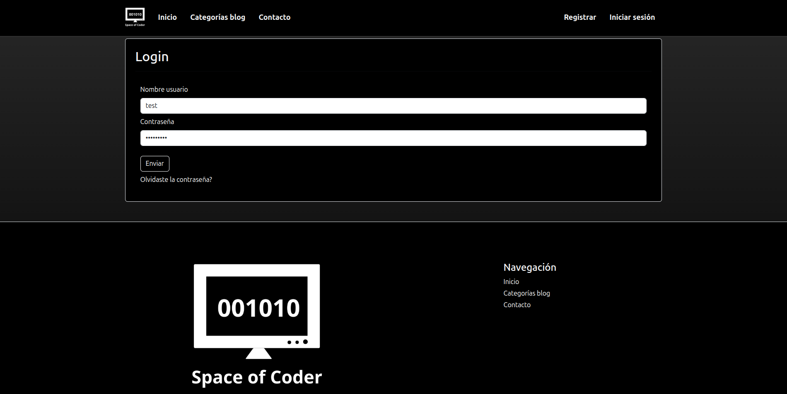
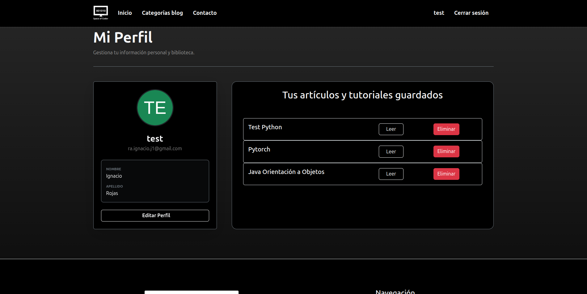
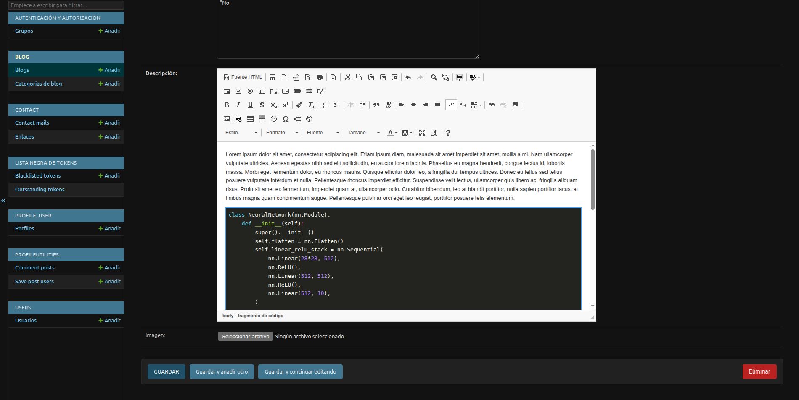
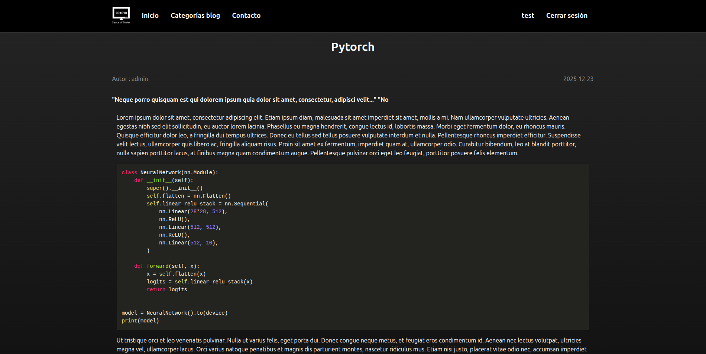

# 🚀 DevBlog Platform - Sistema de Blog para Desarrolladores

Una plataforma Full Stack robusta diseñada para la publicación y consumo de tutoriales de programación. Este proyecto resuelve la necesidad de formatear código correctamente en artículos y permite a los usuarios gestionar su propia biblioteca de aprendizaje mediante un sistema de marcadores ("Leer más tarde").

---

## 📸 Capturas de Pantalla

| Home Page | Login | Profile | 
|:---:|:---:|:---:|
|  |  |  |

| Admin ckeditor| Post code | 
|:---:|:---:|
|  |  |

---

## ✨ Características Principales

### 🔐 Autenticación y Seguridad Robusta
* **Sistema Completo:** Registro, Login, Logout, Recuperación y Cambio de contraseña.
* **Seguridad:** Implementación de **JWT (JSON Web Tokens)** para sesiones stateless y soporte **OAuth2**.
* **Roles:** Diferenciación entre Usuarios estándar, Staff (creadores de contenido) y Superadmin.

### 📚 Gestión de Contenido (CMS)
* **Editor Rico:** Integración de **CKEditor** en el panel de administración, permitiendo escritura de artículos con formato avanzado.
* **Syntax Highlighting:** Soporte nativo para bloques de código, vital para tutoriales de programación.
* **Categorización Avanzada:** Relación *Many-to-Many* entre Posts y Categorías (un post puede pertenecer a "Python" y "Django" simultáneamente).

### 👤 Experiencia de Usuario (User Features)
* **Sistema "Leer más Tarde":** Los usuarios pueden guardar posts en su perfil personal para lectura diferida.
* **Gestión de Biblioteca:** Panel de control donde el usuario puede ver y eliminar sus marcadores guardados.
* **Perfil:** Edición de datos personales.

---

## 🛠️ Stack Tecnológico

La arquitectura sigue el patrón de diseño de **API RESTful**, separando completamente el Backend del Frontend.

### Backend
* **Framework:** Django & Django REST Framework (DRF).
* **Base de Datos:** PostgreSQL (Optimizado para producción).
* **Autenticación:** Djoser + SimpleJWT + Social Auth.
* **Utilidades:** Django-Environ (Manejo de variables de entorno), Pillow (Procesamiento de imágenes).

### Frontend
* **Core:** React.js + Vite (para un build rápido y optimizado).
* **Estado Global:** Redux (Gestión de estado complejo para Auth y Posts).
* **UI/UX:** React-Bootstrap (Diseño responsivo) + CSS Modules.
* **Conexión:** Axios (Manejo de peticiones HTTP).

### DevOps & Entorno
* **Containerización:** Docker & Docker Compose (para orquestación de servicios como la BD).
* **Versionamiento:** Git (Flow con ramas `main` y `develop`).

---

